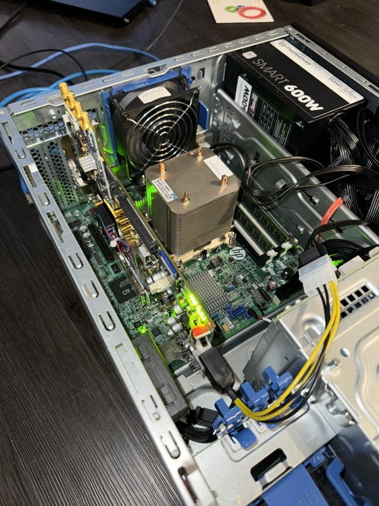
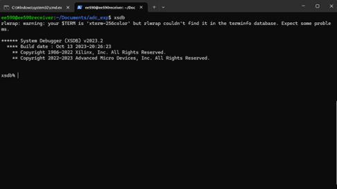
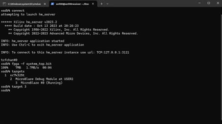
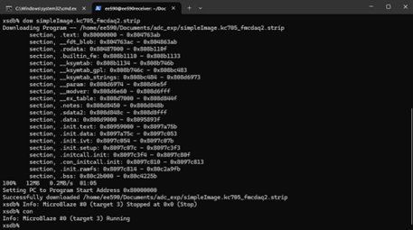
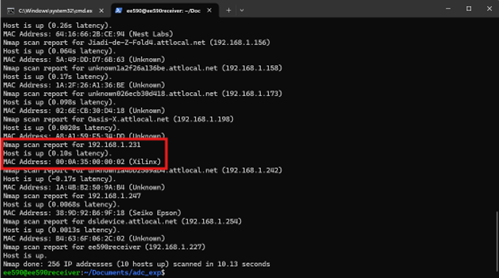
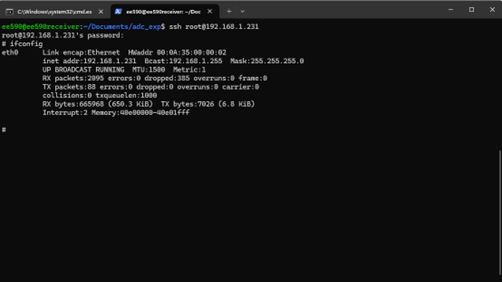
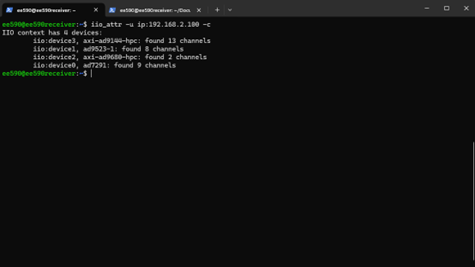
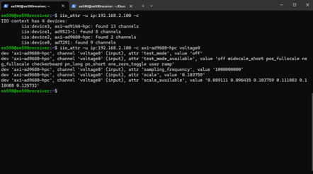
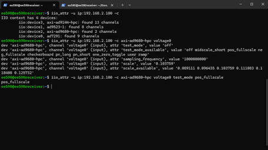

<h1 style="font-size:28px;" align="center">AD-FMCDAQ2-EBZ on KC705 QuickStart Guide</h1>

# 1. Hardware Installation
* Connect the AD-FMCDAQ2-EBZ board to the KC705, on the HPC FMC connector, which is the port that at the far side of the power switch.
* Connect the JTAG (Micro B) cable with the server (PC).
* Connect the Ethernet cable with the KC705 board.
* Make sure the server can provide sufficient power for the board. I use 600W power supply for KC705.
<div align="center">
    
    <br>
    <em>Fig. 1. Hardware Installation Overlook</em>
</div>

# 2.	Software installation
* Vivado 2023.2 installed
* SSH available
* Make sure the necessary Xilinx drivers are installed, otherwise your Vivado may not be able to detect the device.


# 3. Onboard Linux Installation
* In order to access the board, there are 3 progenerated files needed. It is provided by the [link here](https://swdownloads.analog.com/cse/microblaze/2019_r2/simpleImage.kc705_fmcdaq2.zip). More information can be found at [here](https://wiki.analog.com/resources/eval/user-guides/ad-fmcdaq2-ebz/quickstart/microblaze).

* Start the xsdb tool. You may face an error saying that cannot connect jtag, if so, check you Vivado driver. Also make sure you start the xsdb tool under the directory that you save the 3 progenerated files. 
<div align="center">
    
    <br>
    <em>Fig. 2. Start xsdb</em>
</div>

* Once you successfully start the xsdb, type the following commands:

```bash
connect
fpga -f system_top.bit
targets
target 3
dow simpleImage.kc705_fmcdaq2.strip
con
```
These commands will download both the bitfile and the Lunix Kernel into the FPGA board. The simpleImage file may be different if you are using other board. And you can build your own simpleImage file.
<div align="center">
    
    <br>
    <em>Fig. 3. Commands before download the Kernel</em>
</div>

<div align="center">
    
    <br>
    <em>Fig. 4. Finish downloads the Kernel</em>
</div>

* After the downloading, you could exit the xsdb tool by type “exit”. Then you should be able to find the KC705 IP address. I am using the nmap tool to find the KC705 IP address.
<div align="center">
    
    <br>
    <em>Fig. 5. IP address of KC705</em>
</div>

* When you have the IP address, you should be able to SSH to the FPGA board. The Username is “root”, and the password is “analog”.
<div align="center">
    
    <br>
    <em>Fig. 6. SSH to the FPGA board</em>
</div>

# 4.	IIO Oscilloscope Installation
* Since the latest version of libiio V1.0 does not support order version of IIO make files. And the latest GTK2 Based IIO-Oscilloscope version has conflict with the coexistence of GTK+ 2.x and GTK+ 3. So, we will use GTK2 Based IIO-Oscilloscope during this installation.

First, you will need to install the following packages:
```bash
$ apt-get -y install libglib2.0-dev libgtk2.0-dev libgtkdatabox-dev libmatio-dev libfftw3-dev libxml2 libxml2-dev bison flex libavahi-common-dev libavahi-client-dev libcurl4-openssl-dev libjansson-dev cmake libaio-dev libserialport-dev
```
Then get the installation packet from git by:
```bash
$ git clone https://github.com/analogdevicesinc/iio-oscilloscope.git --branch 2021_R2 
$ cd iio-oscilloscope
$ git checkout main
```

* Then build and install the iio-oscilloscope by:
```bash
$ mkdir build && cd build
$ cmake ../ && make -j $(nproc)
$ sudo make install
```
There could be some packet and path you need to setup. Just follow the error detection and install the corresponding packet.

* Then you can open the oscilloscope by either clicking the icon, or type “osc” in the command terminal.
* To connect to the board, go to Settings → Connect and enter the IP address of your KC705. Then it can monitor the selected signal.

# 5.	Local Ethernet connection configuration
* We want to connect the FPGA with the server locally so that we can directly send packet instead of routing to a router. To do this, we need to first set the eno2(eth2) to be a DHCP host port. We first need to configure the 01-network-manager-all.yaml file. You need to complete part3 first.
```bash
$ sudo nano /etc/netplan/01-network-manager-all.yaml
```
* b.	We want the eno2 to be the DHCP host, so we need to turn off the eno2 DHCP client. And give the default gateway it used, set up the nameservers as well. Here is the content:
```bash
# Let NetworkManager manage all devices on this system

network:
  version: 2
  ethernets:
    eno1:
      dhcp4: yes

    eno2:
      dhcp4: no
      addresses:
        - 192.168.2.10/24
      gateway4: 192.168.2.1
      nameservers:
        addresses:
          - 8.8.8.8
          - 8.8.4.4
```
* Apply the new network configuration by: 
```bash
$ sudo netplan apply
```
* Now we need to set the dhcp server configuration. Here we use the isc-dhcp service. Use the command below:
```bash
TODO: add the correct command
```
* Now we need to config the dhcp.conf file by:
```bash
$ sudo nano /etc/dhcp/dhcpd.conf
```
Then change the file by following
```bash
# dhcpd.conf
#
# Sample configuration file for ISC dhcpd
#
# Attention: If /etc/ltsp/dhcpd.conf exists, that will be used as
# configuration file instead of this file.
#

# option definitions common to all supported networks...
option domain-name "example.org";
option domain-name-servers ns1.example.org, ns2.example.org;

default-lease-time 600;
max-lease-time 7200;
log-facility local7;

subnet 192.168.2.0 netmask 255.255.255.0 {
    range 192.168.2.50 192.168.2.150;
    option routers 192.168.2.1;
    option domain-name-servers 192.168.2.1, 8.8.8.8;
}

host mydevice {
    hardware ethernet 00:0A:35:00:00:02;
    fixed-address 192.168.2.100;

```

* Then we need to edit the isc-dhcp-server file by
```bash
$ sudo nano /etc/default/isc-dhcp-server
```
And change the content to
```bash
# Defaults for isc-dhcp-server (sourced by /etc/init.d/isc-dhcp-server)

# Path to dhcpd's config file (default: /etc/dhcp/dhcpd.conf).
#DHCPDv4_CONF=/etc/dhcp/dhcpd.conf
#DHCPDv6_CONF=/etc/dhcp/dhcpd6.conf

# Path to dhcpd's PID file (default: /var/run/dhcpd.pid).
#DHCPDv4_PID=/var/run/dhcpd.pid
#DHCPDv6_PID=/var/run/dhcpd6.pid

# Additional options to start dhcpd with.
#       Don't use options -cf or -pf here; use DHCPD_CONF/ DHCPD_PID instead
#OPTIONS=""

# On what interfaces should the DHCP server (dhcpd) serve DHCP requests?
#       Separate multiple interfaces with spaces, e.g. "eth0 eth1".
INTERFACESv4="eno2"
INTERFACESv6=""

```

# 6.	Iiolib test mode configuration
* a.	Use the command iio_attr to access the ADC/DCA devices. The format using IP to communicate is as follows:
```bash
$ iio_attr -u ip:192.168.2.100 -c
```
Then you can see all the devices inside the daughterboard.
<div align="center">
    
    <br>
    <em>Fig. 7. iio_attr communication list</em>
</div>

* To access specific device, you only need to add the name of the device at the end of the command. And add the parameter you want to check or change.
<div align="center">
    
    <br>
    <em>Fig. 8. axi-ad6980-hpc voltage0 check</em>
</div>

* You can also change the editable parameters by typing the value that you want to change.
<div align="center">
    
    <br>
    <em>Fig. 9. axi-ad6980-hpc change editable parameters</em>
</div>

