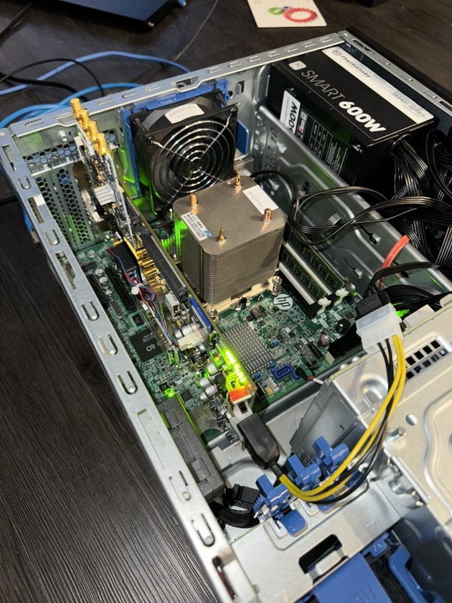

<h1 style="font-size:20px;" align="center">AD-FMCDAQ2-EBZ on KC705 QuickStart Guide</h1>

# 1. Hardware Installation
* a.	Connect the AD-FMCDAQ2-EBZ board to the KC705, on the HPC FMC connector, which is the port that at the far side of the power switch.
* b.	Connect the JTAG (Micro B) cable with the server (PC).
* c.	Connect the Ethernet cable with the KC705 board.
* d.	Make sure the server can provide sufficient power for the board. I use 600W power supply for KC705.

    
     
    <em>Fig. 1. Hardware Installation Overlook</em>

